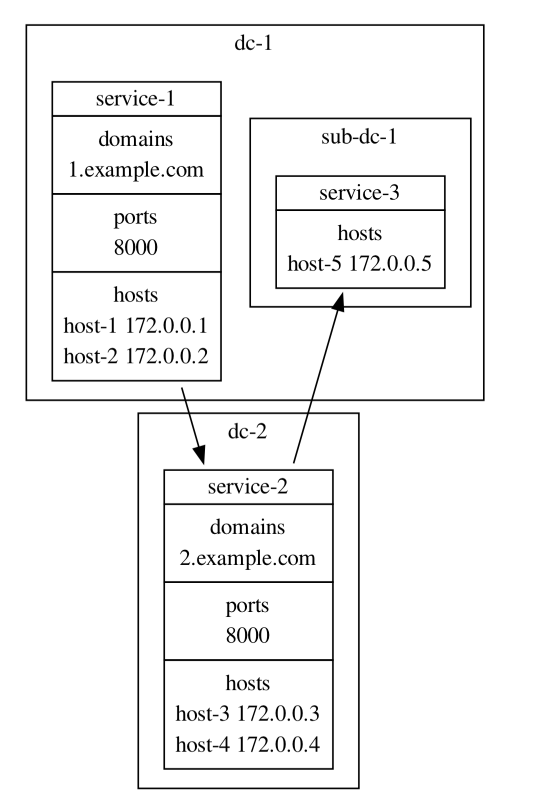

# craftdot

craftdot is a wapper of graphviz to get pretty diagram for your architecture/services diagrams.


## Install

```bash
$ pip install craftdot
```

> craftdot just output the graphviz code(dot file), you need to render the dot file by yourself. install graphviz on local or use graphviz online tools.


## Useage

you can find example in `example/`, then

```bash
$ craftdot example/multi-groups.yml > example/multi-groups.dot

# render the dot file to pdf
$ dot -Tpdf example/multi-groups.dot -o example/multi-groups.pdf
```

above commands converts this:

```yaml
dc-1:
  type: group
  sub-dc-1:
    type: group
    service-3:
      hosts:
        - host-5 172.0.0.5
  service-1:
    domains:
      - 1.example.com
    ports:
      - 8000
    hosts:
      - host-1 172.0.0.1
      - host-2 172.0.0.2
dc-2:
  type: group
  service-2:
    domains:
      - 2.example.com
    ports:
      - 8000
    hosts:
      - host-3 172.0.0.3
      - host-4 172.0.0.4

flows:
  - service-1 -> service-2
  - service-2 -> service-3
```

to:



